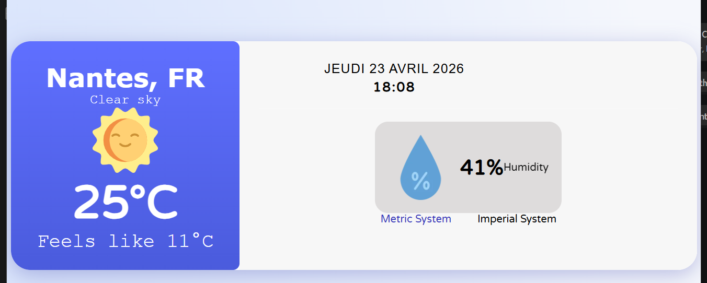

# Weather App

Check the current weather on any city on the planet. Switch between metric and imperial units.

## Features

1. User's ability to search cities

2. Current local time and date

3. Temperatures and humidity

4. Wind speed and direction

5. Sunrise and sunset times

6. Metric vs Imperial system

7. Error handling and loading info

## Installation

1. `git clone https://github.com/madzadev/weather-app.git`

2. `cd weather-app`

3. `npm install`

4. Log-in to [Openweathermap.com](https://openweathermap.org/)

5. Create an API key

6. `cp .env.example .env.local`

7. Paste API key for `OPENWEATHER_API_KEY`

8. `npm run dev`

## Contributions

Any feature requests and pull requests are welcome!

## License

The project is under [MIT license](https://choosealicense.com/licenses/mit/).

Mise à jour du projet

Ce projet est une **amélioration d’une version existante**.

L’ancienne API a été remplacée par **Open-Meteo** pour :
- une meilleure fiabilité
- des données gratuites et sans clé API
- une simplification du code

---

Lien du projet

GitHub :  
https://github.com/holanne1905/weatherapp

Ce que j’ai appris

- Consommation d’une API REST
- Gestion de données asynchrones
- Manipulation de composants React
- Structuration d’un projet frontend

'git clone https://github.com/holanne1905/weatherapp'

